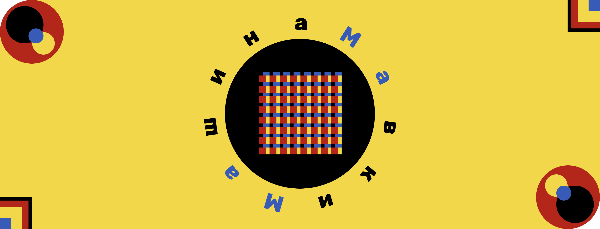

 

# МаМа

Машина вказівок Мавки.

## Вимоги

- Clang
- CMake
- Make

## Використання

Клон репо:

```shell
git clone https://github.com/mavka-ukr/mama
cd mama
git submodule update --init --recursive
cd ..
```

CMakeLists.txt:

```CMake
cmake_minimum_required(VERSION 3.26)
project(mavka)

set(CMAKE_CXX_STANDARD 20)

add_subdirectory(mama)

add_executable(mavka mavka.cpp)
target_link_libraries(mavka PRIVATE mama)
target_compile_options(mavka PRIVATE -fexceptions)
set_target_properties(mavka PROPERTIES OUTPUT_NAME "мавка")
```

mavka.cpp:

```c++
#include "mama/src/mama.h"

using namespace mavka::mama;

int main(int argc, char** argv) {
  const auto source = "2 + 2";

  const auto M = MaMa::Create();

  const auto mainModule = MaModule::Create(M, "старт");
  mainModule->retain();
  M->main_module = mainModule;

  const auto mainDiia = MaDiia::Create(
      M, "старт",
      [&source](MaMa* M, MaObject* diiaObject, MaObject* args, size_t li) {
        return M->eval(source, 0);
      },
      mainModule);
  mainDiia->retain();

  const auto args = MaObject::Empty(M);
  args->retain();

  const auto result = mainDiia->call(M, args, 0);
  if (result.isError()) {
    std::cout << "error" << std::endl;
    return 1;
  }
  std::cout << "result: " << result.asNumber() << std::endl;

  args->release();
  mainDiia->release();
  mainModule->release();

  delete M;

  return 0;
}
```

## Розробка

Клон репо:

```shell
git clone https://github.com/mavka-ukr/mama
cd mama
git submodule update --init --recursive
```

Будування Мавки для тестування:

```shell
bash testing/build.sh
```

Використання Мавки для тестування:

```
./build/мавка testing/старт.м
```

Запуск тестів:

```
bash testing/test.sh
```